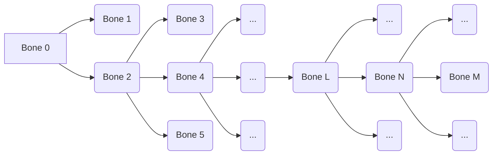

# AssetManager Library
This AssetManager Library is for managing assets used for Game Engine.
It provides asset classes for files below

- Mesh (`StaticMeshAsset`, `SkeletalMeshAsset`
	- Bone(`BoneAsset`)
	- Animation(`AnimationAsset`)
	> Support `.obj`, `.fbx`

- Texture (`BaseTextureAsset`, `ScratchTextureAsset`)
	> Support `.png` / `.exr` / `.hdr`
- Material(`MaterialAsset`)

## Features
### Animation Retargeter
This Library has `AnimationRetargeter` which adjusts the `AnimationAsset` associated with a specific `BoneAsset` to another `BoneAsset`.

- Animation Retargeting Main Algorithm

Figure 1: Hierarchical structure of bones

Each bone has an offset matrix, which can transform the vertex data of the skinned mesh associated with that bone from the bind-pose to the origin. This means that the inverse of the offset matrix transforms the skinned mesh's vertex data, with the origin as the reference coordinate system, back to the bind-pose.

- For Bone 0
Bone 0's bind-pose matrix is: $A_{0_{bind}} = M_{0_{offset}}^{-1}$ where $A_{0_{bind}}$ is bind-pose transformation of Bone 0 relative to it's parent coordinate system(in this case, the World Space Coordinate System. because Bone 0 is Root)

- For Bone 2 : $A_{2_{bind}}A_{0_{bind}} = M_{2_{offset}}^{-1}$ where $A_{2_{bind}}$ is bind-pose transformation of Bone 2 relative to Bone 0's coordinate system. $A_{2_{bind}}$ also be described as
$A_{2_{bind}} =  M_{2_{offset}}^{-1}A_{0_{bind}}^{-1} = M_{2_{offset}}^{-1}M_{0_{offset}}$

- For Bone 4: 
$$A_{4_{bind}}A_{2_{bind}}A_{0_{bind}} = M_{4_{offset}}^{-1}$$
$$A_{4_{bind}} = M_{4_{offset}}^{-1}A_{0_{bind}}^{-1}A_{2_{bind}}^{-1}$$
$$A_{4_{bind}} = M_{4_{offset}}^{-1}M_{0_{offset}}(M_{2_{offset}}^{-1}M_{0_{offset}})^{-1}=M_{4_{offset}}^{-1}M_{2_{offset}}$$

Thus, the general rule for Bone's bind-pose matrix could be 
$A_{N_{bind}} = M_{N_{offset}}^{-1}M_{L_{offset}}$ (See Figure 1 for the relationship between Bone N and Bone L).

Now Let's use **Mathematical Induction** for finding the algorithm of the retargeting.
The fomula $A_{M_{bind}} = M_{M_{offset}}^{-1}M_{N_{offset}}$ holds when $A_{N_{bind}} = M_{N_{offset}}^{-1}M_{L_{offset}}$. 

$$when \quad A_{N_{bind}} = M_{N_{offset}}^{-1}M_{L_{offset}}$$
$$A_{N_{bind}} = A_{N_{bind}}...A_{N_{bind}}M_{L_{offset}}$$
$$A_{M_{bind}}A_{N_{bind}} = A_{M_{bind}}A_{N_{bind}}...A_{N_{bind}}M_{L_{offset}}$$
$$A_{M_{bind}} = M_{M_{offset}}^{-1}M_{L_{offset}}A_{N_{bind}}^{-1}$$
$$A_{M_{bind}} = M_{M_{offset}}^{-1}M_{L_{offset}}M_{L_{offset}}^{-1}M_{N_{offset}}$$
$$\therefore A_{M_{bind}} = M_{M_{offset}}^{-1}M_{N_{offset}}$$

By Using the recurrence relation proven above, we can express the local transformation for the bind-pose of a specific bone. If Given an Animation Asset **A** matched to Bone Asset **A**, a new Animation Asset **B** matched to Bone Asset **B** can be derived by compensating the keyframe transformation data of Animation Asset **A** for each channel(bone). This is achieved by multiplying the *inverse of the local transformation for the bind-pose of Bone of Bone Asset **A** with the local transformation for the bind-pose of Bone of Bone Asset **B***.
