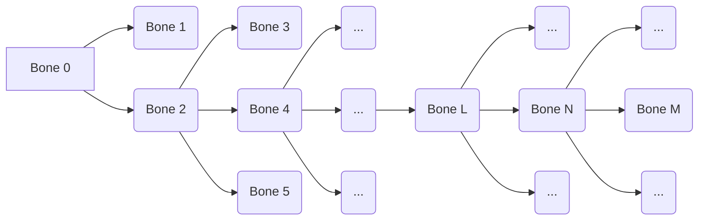

# AssetManager Library
This AssetManager Library is for managing assets used for Game Engine.
It provides asset classes for files below

- Mesh (`StaticMeshAsset`, `SkeletalMeshAsset`)
	- Bones(`BoneAsset`)
	- Animation(`AnimationAsset`)
	> Support `.obj`, `.fbx`

- Texture (`BaseTextureAsset`, `ScratchTextureAsset`)
	> Support `.png` / `.exr` / `.hdr`
- Material(`ModelMaterialAsset`, `IBLMaterialAsset`)
- Map(`MapAsset`)

## Features
### Dependency
Need `DirectXMath`(and `DirectXTex`), `Assimp`, `Zlib` Header and Library files. 
### Class Structure
AssetManager's Class Diagram is Designed in 'ClassDiagram.cd' file.

### Serialize/Deserialize
`AAsset` inherits from `ISerializable`. Therefore, classes that inherit from `AAsset`, such as the Asset class, implement `Serialize(FILE* fileIn)` and `Deserialize(FILE* fileIn` in each class. This allows assets to be managed as raw files, and for textures, compression is performed using libraries such as `zlib`.

### Mesh Asset
Mesh data can be represented in various forms. In this `AssetManager`, the vertex data within a modeling file is managed as multiple parts through the `MeshPartsData`. For static modeling files, the `StaticMeshPartsData` inherits from `MeshPartsData`, and for skeletal modeling files, the `SkeletalMeshPartsData` class inherits from `StaticMeshPartsData` to manage the data.

`MeshPartsData` manages the data for each vertex and contains the offset of the indices for draw calls per part. In other words, the vertex data of the modeling file is stored in a single container, regardless of parts, but the offset information of the indices allows differentiation between parts.
* Check `MeshPartsData` in MeshAsset.h 

`AMeshAsset` is a wrapper class designed to manage `MeshPartsData`, intended for cases where a single model might exist in multiple groups based on LOD. `AMeshAsset` manages the default materials for each part. `StaticMeshAsset` and `SkeletalMeshAsset` inherit from `AMeshAsset`, and each manages modeling data for LOD keys through member variables: `std::map<uint32_t, std::shared_ptr<StaticMeshPartsData>>` for `StaticMeshAsset` and `std::map<uint32_t, std::shared_ptr<SkeletalMeshPartData>>` for `SkeletalMeshAsset.`

### Animation Retargeter
This Library has `AnimationRetargeter` which adjusts the `AnimationAsset` associated with a specific `BoneAsset` to another `BoneAsset`.

Figure 1: Hierarchical structure of bones

- Local Bind-Pose Transformation
Each bone has an offset matrix, which can transform the vertex data of the skinned mesh associated with that bone from the bind-pose to the origin. This means that the inverse of the offset matrix transforms the skinned mesh's vertex data, with the origin as the reference coordinate system, back to the bind-pose.

	- For Bone 0
Bone 0's bind-pose matrix is: $P_{0_{bind}} = M_{0_{offset}}^{-1}$ where $P_{0_{bind}}$ is bind-pose transformation of Bone 0 relative to it's parent coordinate system(in this case, the World Space Coordinate System. because Bone 0 is Root)

	- For Bone 2 : $P_{2_{bind}}P_{0_{bind}} = M_{2_{offset}}^{-1}$ where $P_{2_{bind}}$ is bind-pose transformation of Bone 2 relative to Bone 0's coordinate system. $P_{2_{bind}}$ also be described as
$P_{2_{bind}} =  M_{2_{offset}}^{-1}P_{0_{bind}}^{-1} = M_{2_{offset}}^{-1}M_{0_{offset}}$

	- For Bone 4: $P_{4_{bind}}P_{2_{bind}}P_{0_{bind}} = M_{4_{offset}}^{-1}$ where $P_{4_{bind}}$ is bind-pose transfromation of Bone 4 relative to Bone 2's coordinate system. $$P_{4_{bind}} = M_{4_{offset}}^{-1}P_{0_{bind}}^{-1}P_{2_{bind}}^{-1}= M_{4_{offset}}^{-1}M_{0_{offset}}(M_{2_{offset}}^{-1}M_{0_{offset}})^{-1}=M_{4_{offset}}^{-1}M_{2_{offset}}$$

	Thus, the general rule for Bone's local bind-pose matrix could be 
	$P_{N_{bind}} = M_{N_{offset}}^{-1}M_{L_{offset}}$ (See Figure 1 for the relationship between Bone N and Bone L).

	Through **Mathematical Induction**, if $P_{N_{bind}} = M_{N_{offset}}^{-1}M_{L_{offset}}$ holds true, and it is shown that $P_{M_{bind}} = M_{M_{offset}}^{-1}M_{N_{offset}}$ also holds true under this assumption, then the general rule we presented can be confirmed as valid for all bones in any tree structure.

$$when \quad P_{N_{bind}} = M_{N_{offset}}^{-1}M_{L_{offset}}$$
$$P_{N_{bind}} = P_{N_{bind}}...P_{N_{bind}}M_{L_{offset}}$$
$$P_{M_{bind}}P_{N_{bind}} = P_{M_{bind}}P_{N_{bind}}...P_{N_{bind}}M_{L_{offset}}$$
$$P_{M_{bind}} = M_{M_{offset}}^{-1}M_{L_{offset}}P_{N_{bind}}^{-1}$$
$$P_{M_{bind}} = M_{M_{offset}}^{-1}M_{L_{offset}}M_{L_{offset}}^{-1}M_{N_{offset}}$$
$$\therefore P_{M_{bind}} = M_{M_{offset}}^{-1}M_{N_{offset}}$$

- Animation Compensation With Local Bind-Pose Transformation
By Using the recurrence relation proven above, we can express the local transformation for the bind-pose of a specific bone. and we can use it for handling the Animation Retargeting.
An Animation Asset contains channels that correspond to specific bones. Each channel holds keyframe transformations, which are used to transform skinned vertex data from the local bone coordinates. and it could be seperated into two parts. *From Origin To Bind-Pose*, *From Bind-Pose To Animated Pose*.
$$ C_{A_N} = F_{N_{animated}}P_{A_{N_{bind}}}  $$
	$C_{A_N}$ is keyframe transformation of Bone N of Bone Asset A, $P_{A_{N_{bind}}}$ is transformation from origin to bind-pose of the Bone N of Bone Asset A, $F_{N_{animated}}$ is tranformation from bind-pose to animated pose.
Let us assume we have Animation Asset A corresponding to Bone Asset A and the data for Bone Asset B. If we want to retarget Animation Asset A with Bone Asset B, we need to replace the second term of the keyframe transformation with the  local bind-pose transformation for Bone Asset B per channel(bone).
Thus, we can achieve this by multiplying the keyframe transformation of Animation A by $P_{A_{N_{bind}}}^{-1}P_{B_{N_{bind}}}$.

$$  C_{B_N} = C_{A_N} P_{A_{N_{bind}}}^{-1}P_{B_{N_{bind}}}$$ $$ = F_{N_{animated}}P_{A_{N_{bind}}} P_{A_{N_{bind}}}^{-1}P_{B_{N_{bind}}} = F_{N_{animated}}P_{B_{N_{bind}}}$$

This compensation process is built in `AnimationRetargeter` class and it  allows us to generate a new `AnimationAsset` by passing the source `AnimationAsset`, source `BoneAssset`, destination `BoneAsset`.

